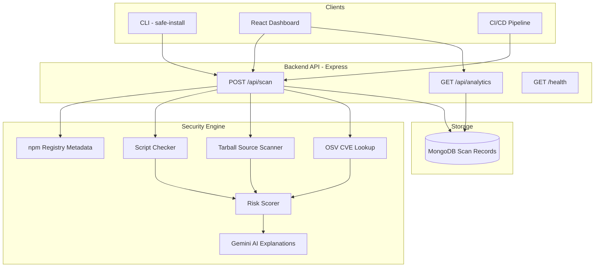

# Safe Install

**AI-powered npm supply chain security scanner — scan before you install.**

Safe Install is a full-stack security platform that analyzes npm packages for vulnerabilities, malicious install scripts, and suspicious source code **before** they land in your `node_modules`. It combines static analysis, CVE lookups, and Google Gemini AI explanations in a developer-friendly CLI and web dashboard.

Built for developers who want supply-chain protection without enterprise tooling overhead — ideal for hackathons, portfolios, and real-world `npm install` workflows.

---

## Table of Contents

- [The Problem](#the-problem)
- [Our Solution](#our-solution)
- [Key Features](#key-features)
- [Architecture](#architecture)
- [Tech Stack](#tech-stack)
- [How Scanning Works](#how-scanning-works)
- [Project Structure](#project-structure)
- [Getting Started](#getting-started)
- [Usage](#usage)
- [API Reference](#api-reference)
- [Testing](#testing)
- [Demo Scenarios](#demo-scenarios)
- [Resume Highlights](#resume-highlights)
- [Roadmap](#roadmap)
- [License](#license)

---

## The Problem

npm supply chain attacks are one of the fastest-growing threats in modern software development:

- **Malicious install scripts** (`preinstall`, `postinstall`) can exfiltrate secrets, SSH keys, or `.npmrc` tokens the moment you run `npm install`.
- **Typosquatting** tricks developers into installing look-alike packages.
- **Known CVEs** in dependencies often go unnoticed until production.
- **No built-in guardrail** — `npm install` runs lifecycle scripts by default with no security pre-check.

> *"One compromised package can compromise an entire organization."*

Safe Install puts a security gate **between** `npm install` and your machine.

---

## Our Solution

Safe Install provides three ways to scan packages:

| Surface | Who it's for | What it does |
|---------|--------------|--------------|
| **CLI** (`safe-install`) | Developers in the terminal | Scans a package, blocks unsafe installs, then runs `npm install` only if safe |
| **Web Dashboard** | Teams & demos | Interactive UI with live scanning, AI explanations, and analytics |
| **REST API** | Integrations & CI/CD | Programmatic scanning endpoint for pipelines and custom tools |

If the backend is unreachable, the CLI falls back to a local rules engine so developers are never left without a scan.

---

## Key Features

### Security Engine
- **Install script analysis** — Detects suspicious patterns in `preinstall`, `install`, `postinstall`, and `prepare` hooks (`curl`, `wget`, `eval`, `child_process`, remote URLs, shell execution, etc.)
- **Source tarball scanning** — Downloads and statically analyzes up to 200 JS/TS files from the published package
- **CVE detection** — Queries [OSV.dev](https://osv.dev) for known vulnerabilities in the target version
- **Risk scoring** — Aggregates findings into a severity level (`none` → `critical`) and a clear safe/unsafe verdict
- **AI explanations** — Google Gemini generates human-readable Risk / Impact / Recommendation summaries (falls back to rule-based text when no API key is set)

### CLI (`safe-install`)
- Scan-then-install workflow with colored terminal output
- `--dry-run` to scan without installing
- Offline fallback when the API is down
- Supports `npm install -g` and `--save-dev` flags

### Web Dashboard
- Modern React UI with dark/light theme
- Live package scanner with example shortcuts
- Scan results panel with severity badges and AI explanations
- Analytics dashboard (scan volume, risk distribution, blocked installs)
- Graceful mock-data fallback for offline demos

### Production-Ready Backend
- Express 5 REST API with Helmet, CORS, and rate limiting
- MongoDB persistence for scan history and analytics (optional in dev)
- Health check endpoint for deployment monitoring
- Input validation for npm package name format

---

## Architecture



---

## Tech Stack

| Layer | Technologies |
|-------|-------------|
| **Frontend** | React 19, Vite 8, Tailwind CSS 4, Zustand, Recharts |
| **Backend** | Node.js 18+, Express 5, Mongoose, Helmet, express-rate-limit |
| **CLI** | Commander.js, Axios, Chalk |
| **Security** | Custom static analysis, OSV.dev API, npm registry API |
| **AI** | Google Gemini 2.5 Flash (`@google/generative-ai`) |
| **Database** | MongoDB (optional — analytics & scan history) |

---

## How Scanning Works

When you scan a package (e.g. `axios`), the security engine runs this pipeline:

```
1. Fetch metadata     →  npm registry (latest version, scripts, tarball URL)
2. Script analysis    →  Pattern-match install hooks for dangerous commands
3. Source scan        →  Download tarball, extract, analyze JS/TS for risky APIs
4. CVE lookup         →  Query OSV.dev for known vulnerabilities
5. Risk scoring       →  Compute max severity and safe/unsafe verdict
6. AI explanation     →  Gemini summarizes findings in plain English
7. Persist (optional) →  Save scan record to MongoDB for analytics
```

**Severity levels:** `none` · `low` · `medium` · `high` · `critical`

**Verdict logic:** Packages with `medium` or higher severity are marked **unsafe** and blocked by the CLI.

---

## Project Structure

```
dummypackage/
├── backend/                  # Express API & security engine
│   ├── config/               # Environment & database config
│   ├── controllers/          # Scan & analytics request handlers
│   ├── middleware/           # Validation, error handling
│   ├── models/               # Mongoose ScanRecord schema
│   ├── routes/               # /api/scan, /api/analytics
│   ├── services/             # Core scanning logic
│   │   ├── securityEngine.js # Orchestrates the full scan pipeline
│   │   ├── scriptChecker.js  # Install hook pattern detection
│   │   ├── sourceScanner.js  # Tarball download & static analysis
│   │   ├── cveService.js     # OSV.dev integration
│   │   ├── riskScorer.js     # Severity aggregation & verdicts
│   │   ├── aiService.js      # Gemini explanations
│   │   └── npmService.js     # npm registry client
│   └── tests/                # Node.js native test runner
│
├── frontend/                 # React dashboard
│   └── src/
│       ├── components/       # Hero, Scanner, Results, Analytics
│       ├── services/         # API client with mock fallback
│       └── store/            # Zustand state management
│
├── cli/                      # safe-install CLI tool
│   ├── index.js              # Main entry point
│   ├── fallback-scan.js      # Offline rules engine
│   └── local-scan.js         # Local unpublished package scanning
│
└── malicious-test-pkg/       # Test fixture with suspicious preinstall script
```

---

## Getting Started

### Prerequisites

- **Node.js** 18 or higher
- **npm** (comes with Node)
- **MongoDB** (optional — required for analytics persistence; scans work without it)
- **Google Gemini API key** (optional — enables AI explanations)

### 1. Clone the repository

```bash
git clone <your-repo-url>
cd dummypackage
```

### 2. Backend setup

```bash
cd backend
npm install
cp .env.example .env
```

Edit `backend/.env`:

```env
NODE_ENV=development
PORT=5000
MONGODB_URI=                          # Optional for local dev
CORS_ORIGIN=http://localhost:5173
GEMINI_API_KEY=                       # Optional — AI explanations
```

Start the API:

```bash
npm run dev
# Server runs at http://localhost:5000
```

Verify it's running:

```bash
curl http://localhost:5000/health
```

### 3. Frontend setup

```bash
cd frontend
npm install
```

Create `frontend/.env` (or `.env.local`):

```env
VITE_API_URL=http://localhost:5000
```

Start the dashboard:

```bash
npm run dev
# Dashboard runs at http://localhost:5173
```

### 4. CLI setup

```bash
cd cli
npm install
```

Optional — point the CLI at your backend:

```env
# cli/.env
SAFE_INSTALL_API=http://localhost:5000/api/scan
```

Link globally (optional):

```bash
npm link
```

---

## Usage

### CLI — Scan before install

```bash
# Scan and install if safe
node cli/index.js lodash

# Scan only (no install)
node cli/index.js --dry-run axios

# Install as dev dependency
node cli/index.js --save-dev express

# Require backend (no offline fallback)
node cli/index.js --no-fallback react

# Custom API endpoint
node cli/index.js lodash --api http://localhost:5000/api/scan
```

**Blocked install example:**

```bash
node cli/index.js bad-package
# Severity: CRITICAL
# Installation BLOCKED by Safe-Install.
```

**Safe install example:**

```bash
node cli/index.js --dry-run lodash
# Severity: NONE
# Dry-run completed successfully. Package is safe to install.
```

### Web Dashboard

1. Open `http://localhost:5173`
2. Scroll to **Package Scanner**
3. Enter a package name (e.g. `axios`, `lodash`, `express`)
4. Review severity, AI explanation, observations, and recommended fix
5. View **Analytics Dashboard** for scan trends (requires MongoDB)

### API — Direct integration

```bash
# Scan a package
curl -X POST http://localhost:5000/api/scan \
  -H "Content-Type: application/json" \
  -d '{"package": "lodash"}'
```

**Example response:**

```json
{
  "package": "lodash",
  "version": "4.17.21",
  "safe": true,
  "severity": "none",
  "explanation": "Risk:\nNo significant threats detected...\n\nImpact:\n...\n\nRecommendation:\n...",
  "observations": [],
  "cves": [],
  "threat": null,
  "fix": null
}
```

---

## API Reference

| Method | Endpoint | Description |
|--------|----------|-------------|
| `GET` | `/health` | Service health & database status |
| `GET` | `/` | API info and available endpoints |
| `POST` | `/api/scan` | Scan an npm package (`{ "package": "name" }`) |
| `GET` | `/api/analytics` | Dashboard stats (totals, daily volume, risk distribution) |
| `GET` | `/api/analytics/recent` | Recent scan records |
| `GET` | `/api/analytics/package/:name` | Scan history for a specific package |
| `GET` | `/api/analytics/vulnerabilities` | Vulnerability breakdown by severity |

**Rate limiting:** 100 requests per 15 minutes per IP (configurable via `.env`).

---

## Testing

### Backend unit tests

```bash
cd backend
npm test
```

Tests cover risk scoring, file content analysis, and verdict computation.

### CLI test scripts

```bash
cd cli

# Test blocked package (fallback rules)
npm run test:blocked

# Test safe package (dry-run)
npm run test:safe

# Test fallback when backend is down
npm run test:fallback
```

### Local malicious package fixture

The `malicious-test-pkg/` directory contains a **safe, unpublished test package** with a mock suspicious `preinstall` script (no real network calls). Use it to verify script detection:

```bash
# Scan the local fixture via local-scan module
node -e "import('./cli/local-scan.js').then(m => console.log(m.scanLocalPackage('malicious-test-pkg')))"
```

Expected result: `safe: false`, `severity: critical`, with observations about `curl` and remote URLs in the `preinstall` hook.

---

## Demo Scenarios

Use these during hackathon judging or portfolio walkthroughs:

| Scenario | Command / Action | Expected outcome |
|----------|-------------------|------------------|
| Safe popular package | Scan `lodash` or `axios` | `safe: true`, severity `none` |
| Malicious script detection | Scan `malicious-test-pkg` locally | `safe: false`, critical severity |
| Blocked install (CLI) | `node cli/index.js bad-package` | Exit code 1, install blocked |
| AI explanation | Set `GEMINI_API_KEY`, scan any package | Structured Risk / Impact / Recommendation |
| Offline resilience | Stop backend, run CLI scan | Yellow warning, fallback scan used |
| Analytics dashboard | Scan several packages with MongoDB connected | Charts update with scan volume & risk data |

---

## Resume Highlights

Copy-paste friendly bullets for your resume or LinkedIn:

- Built **Safe Install**, a full-stack npm supply chain security platform with CLI, REST API, and React dashboard serving scan-then-install workflows
- Engineered a **multi-layer security scanner** combining install-script pattern matching, tarball static analysis, OSV CVE lookups, and Google Gemini AI explanations
- Designed **offline-first CLI architecture** with automatic backend fallback, rate-limited Express API, and MongoDB-backed analytics dashboard
- Implemented **risk scoring engine** with severity aggregation (`none`–`critical`) that blocks `npm install` for packages with medium+ risk findings
- Tech: **Node.js, Express, React, MongoDB, Google Gemini AI, Tailwind CSS, Zustand, Commander.js**

**One-liner for project section:**

> *Safe Install — AI-powered npm package scanner that detects malicious install scripts, CVEs, and suspicious source code before installation. Full-stack: Node.js API, React dashboard, CLI tool.*

---

## Roadmap

- [ ] Re-enable full tarball scanning and CVE checks in production pipeline
- [ ] Add `GET /api/scan/:package` for frontend parity
- [ ] Typosquatting detection (Levenshtein distance against popular packages)
- [ ] GitHub Action for CI/CD integration (`safe-install/action`)
- [ ] VS Code extension for inline package warnings
- [ ] npm publish of `safe-install` CLI package
- [ ] Webhook alerts for critical findings in team dashboards

---

## License

- **CLI:** MIT
- **Backend:** ISC

---

## Acknowledgments

- [OSV.dev](https://osv.dev) — Open source vulnerability database
- [npm Registry API](https://github.com/npm/registry/blob/master/docs/REGISTRY-API.md) — Package metadata
- [Google Gemini](https://ai.google.dev/) — AI-powered security explanations

---

<p align="center">
  <strong>Scan first. Install safely.</strong><br>
  Built with care for developers who ship fast — and ship secure.
</p>
